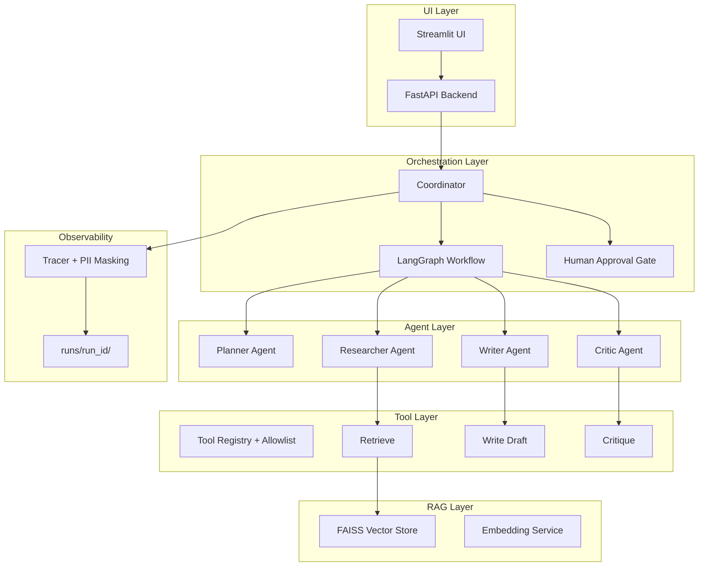
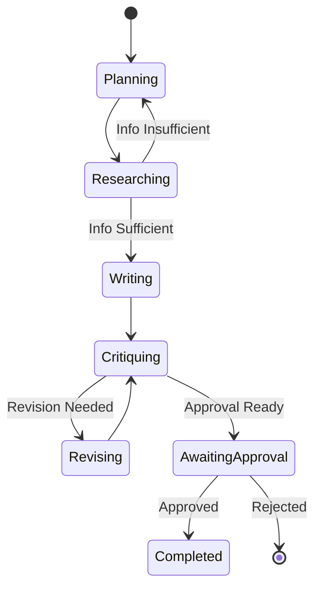

# Multi-Agent Ops Demo

[](https://www.python.org/downloads/)
[](https://opensource.org/licenses/MIT)
[](https://github.com/psf/black)

Production-ready Multi-Agent AI System Demo Repository.
Executes a workflow where multiple AI agents collaborate to "create a customer proposal based on internal documents".

## 🎯 Features

In this demo, you can experience a multi-agent system with the following capabilities:

- **Role Division**: 4 specialized agents (Planner, Researcher, Writer, Critic)
- **Tool Execution**: Tools for RAG search, draft generation, quality evaluation, etc.
- **Audit Logs/Traces**: Records all processes in JSONL format
- **Guardrails**: Multiple constraints for safe execution
- **Failure Recovery**: Generation of additional questions when information is missing

## 🏗️ Architecture



## 👥 Agent Configuration

### Coordinator-Worker Pattern

This system adopts the **Coordinator-Worker** pattern:

```
┌─────────────────────────────────────────────────────────────┐
│                      Coordinator                             │
│  - Workflow Control                                          │
│  - State Management                                          │
│  - Approval Gate Management                                  │
└───────────┬─────────────────────────────────────────────────┘
            │
    ┌───────┴───────┬───────────────┬───────────────┐
    ▼               ▼               ▼               ▼
┌─────────┐   ┌───────────┐   ┌─────────┐   ┌─────────┐
│ Planner │   │ Researcher│   │  Writer │   │  Critic │
│         │   │           │   │         │   │         │
│ Req Org │   │ RAG Search│   │ Draft   │   │ Quality │
│ Task Dec│   │ Evidence  │   │ Gen     │   │ Eval    │
└─────────┘   └───────────┘   └─────────┘   └─────────┘
```

### Agent Roles and Responsibilities

| Agent | Role | Input | Output |
|------------|------|------|------|
| **Planner** | Requirement organization and task decomposition | User Request | Requirement list, task list, additional questions |
| **Researcher** | Evidence gathering via RAG search | Search Topics | Findings, citations, missing info |
| **Writer** | Proposal draft generation | Requirements, findings | Markdown draft with citations |
| **Critic** | Quality check, improvement instructions | Draft, findings | Score, issues, improvement suggestions |

### Workflow



## 🛡️ Guardrail Design

Safety design for production use:

| Guardrail | Implementation | Purpose |
|------------|------|------|
| **Tool Allowlist** | `registry.py` | Only allowed tools can be executed |
| **Path Restriction** | `guardrails.py` | Write access restricted to `runs/` directory |
| **Max Steps** | Env Var `MAX_STEPS` | Prevent infinite loops (Default: 20) |
| **Max Parallel** | Env Var `MAX_PARALLEL` | Resource limit (Default: 3) |
| **PII Masking** | `logger.py` | Prevent PII leakage in logs |
| **Human Approval** | `approval.py` | Confirmation required before final output (`AUTO_APPROVE=false`) |

### Allowed Tools (Allowlist)

```python
DEFAULT_ALLOWLIST = {
    "retrieve",        # RAG search
    "write_draft",     # Draft writing
    "critique",        # Quality evaluation
    "summarize",       # Summary generation
    "search_documents", # Document search
    "get_context",     # Context retrieval
}
```

## 📁 Directory Structure

```
multi-agent-ops-demo/
├── app/
│   ├── agents/           # Agent Definitions
│   │   ├── base.py       # BaseAgent, LLMClient
│   │   ├── planner.py    # Planner Agent
│   │   ├── researcher.py # Researcher Agent (RAG Integration)
│   │   ├── writer.py     # Writer Agent
│   │   ├── critic.py     # Critic Agent
│   │   └── prompts.py    # Prompt Templates
│   │
│   ├── orchestrator/     # Orchestration
│   │   ├── coordinator.py # Coordinator (Main Control)
│   │   ├── state.py      # State Management (TypedDict)
│   │   ├── approval.py   # Approval Gate
│   │   └── graph.py      # LangGraph Workflow
│   │
│   ├── tools/            # Tool Definitions
│   │   ├── registry.py   # Tool Registration + Allowlist
│   │   ├── retrieve.py   # RAG Search Tool
│   │   ├── write_draft.py # Draft Writing
│   │   ├── critique.py   # Critique Tool
│   │   └── summarize.py  # Summarize Tool
│   │
│   ├── rag/              # RAG Module
│   │   ├── embeddings.py # Embedding Generation
│   │   ├── vector_store.py # FAISS Store
│   │   └── retriever.py  # Search Interface
│   │
│   ├── api/              # FastAPI
│   │   ├── main.py       # Application
│   │   ├── routes.py     # Endpoints
│   │   └── schemas.py    # Pydantic Schemas
│   │
│   ├── ui/               # Streamlit UI
│   │   ├── streamlit_app.py
│   │   └── components.py
│   │
│   ├── observability/    # Observability
│   │   ├── tracer.py     # Trace Logger
│   │   └── run_manager.py # Run Output Management
│   │
│   └── common/           # Common Utilities
│       ├── config.py     # Configuration Management
│       ├── logger.py     # PII Masking Logger
│       └── guardrails.py # Guardrails
│
├── data/documents/       # Sample Documents
├── runs/                 # Execution Output (Auto-generated)
├── tests/                # Test Suite
├── .env.example          # Environment Variable Template
├── requirements.txt
└── pyproject.toml
```

## 🚀 Quick Start

### Prerequisites

- Python 3.11+
- pip or uv

### Installation

```bash
# Clone the repository
git clone https://github.com/yourusername/multi-agent-ops-demo.git
cd multi-agent-ops-demo

# Create virtual environment
python -m venv .venv
source .venv/bin/activate  # Windows: .venv\Scripts\activate

# Install dependencies
pip install -r requirements.txt

# Set up environment variables
cp .env.example .env
# Edit .env to configure settings
```

### Run with Streamlit UI

```bash
streamlit run app/ui/streamlit_app.py
```

Open http://localhost:8501 in your browser.

### Run with API Server

```bash
# Start FastAPI server
uvicorn app.api.main:app --reload --port 8000

# Request execution in separate terminal
curl -X POST http://localhost:8000/api/v1/run \
  -H "Content-Type: application/json" \
  -d '{"request": "Please create a proposal for AI implementation for a medium-sized manufacturing company"}'
```

### Run in Stub Mode (No LLM API required)

Stub mode is enabled by default. Check `.env` file:

```env
LLM_MODE=stub
EMBEDDING_MODE=stub
```

## 📊 Observability

Each run generates the following files in `runs/<run_id>/`:

```
runs/abc12345/
├── plan.json        # Planning phase output
├── retrieved.json   # Research findings
├── draft.md         # Latest draft
├── draft_v1.md      # Draft v1
├── draft_v2.md      # Draft v2 (after revision)
├── critique.md      # Critique report
├── critique.json    # Critique data
├── final.md         # Final approved version
├── state.json       # Complete state
└── trace.jsonl      # Execution trace
```

### Trace Format

```json
{
  "run_id": "abc12345",
  "timestamp": "2024-01-15T10:30:00.000Z",
  "agent": "researcher",
  "action": "search",
  "input": {"topics": ["Product Info", "Price"]},
  "output": {"findings": [...]},
  "success": true,
  "step": 3
}
```

## 🧪 Tests

```bash
# Run all tests
pytest tests/ -v

# Individual tests
pytest tests/test_approval_gate.py -v     # Approval gate tests
pytest tests/test_tool_allowlist.py -v    # Allowlist tests
pytest tests/test_trace_saving.py -v      # Trace saving tests
pytest tests/test_failure_scenario.py -v  # Failure scenario tests

# With coverage
pytest tests/ --cov=app --cov-report=html
```

## 🔧 Extension Guide

### Swapping LLM

Switch in `.env` file:

```env
# Stub mode (for testing)
LLM_MODE=stub

# OpenAI
LLM_MODE=openai
OPENAI_API_KEY=your-api-key
OPENAI_MODEL=gpt-4o-mini

# Ollama (Local)
LLM_MODE=ollama
OLLAMA_BASE_URL=http://localhost:11434
OLLAMA_MODEL=llama3.2
```

### Adding Tools

1. Create a new tool in `app/tools/`:

```python
# app/tools/my_tool.py
def my_tool(arg1: str, arg2: int) -> dict:
    """My custom tool."""
    return {"result": f"{arg1}: {arg2}"}
```

2. Add to Allowlist in `app/common/guardrails.py`:

```python
DEFAULT_ALLOWLIST = frozenset({
    "retrieve",
    "write_draft",
    ...
    "my_tool",  # Added
})
```

3. Register in Registry:

```python
from app.tools.registry import get_tool_registry

registry = get_tool_registry()

@registry.register("my_tool", "My custom tool description")
def my_tool(arg1: str, arg2: int) -> dict:
    ...
```

### Adding Memory

Extend `app/orchestrator/state.py` to add conversation history or long-term memory:

```python
class WorkflowState(TypedDict, total=False):
    ...
    # Added
    conversation_history: list[dict[str, str]]
    long_term_memory: dict[str, Any]
```

### CrewAI / AutoGen Integration

Integration with CrewAI or AutoGen is possible by swapping the orchestration layer:

1. Create `app/orchestrator/crewai_adapter.py`
2. Wrap `Coordinator` class with CrewAI Crew
3. Convert each agent to CrewAI Agent

See [docs/crewai_integration.md](docs/crewai_integration.md) for details (future addition).

## 📚 API Reference

### Endpoints

| Method | Path | Description |
|---------|------|------|
| POST | `/api/v1/run` | Start new run |
| GET | `/api/v1/status/{run_id}` | Check status |
| GET | `/api/v1/run/{run_id}` | Get details |
| POST | `/api/v1/approve/{run_id}` | Approve/Reject |
| GET | `/api/v1/runs` | List history |
| GET | `/api/v1/trace/{run_id}` | Get trace |
| GET | `/api/v1/files/{run_id}` | List files |
| GET | `/api/v1/file/{run_id}/{filename}` | Get file content |
| DELETE | `/api/v1/run/{run_id}` | Delete run |

### Start Run

```bash
curl -X POST http://localhost:8000/api/v1/run \
  -H "Content-Type: application/json" \
  -d '{
    "request": "Please create a proposal for an AI quality control system for a medium-sized manufacturing company",
    "customer_context": "500 employees, manufacturing, considering automation of quality inspection"
  }'
```

### Approve

```bash
curl -X POST http://localhost:8000/api/v1/approve/abc12345 \
  -H "Content-Type: application/json" \
  -d '{"approved": true, "comments": "No issues"}'
```

## 🤝 Contribution

1. Fork the repository
2. Create your feature branch (`git checkout -b feature/amazing-feature`)
3. Commit your changes (`git commit -m 'Add some amazing feature'`)
4. Push to the branch (`git push origin feature/amazing-feature`)
5. Open a Pull Request

## 📄 License

MIT License - See [LICENSE](LICENSE) for details.

## 🙏 Acknowledgements

- [LangGraph](https://github.com/langchain-ai/langgraph) - Workflow Orchestration
- [FAISS](https://github.com/facebookresearch/faiss) - Vector Search
- [FastAPI](https://fastapi.tiangolo.com/) - API Framework
- [Streamlit](https://streamlit.io/) - UI Framework